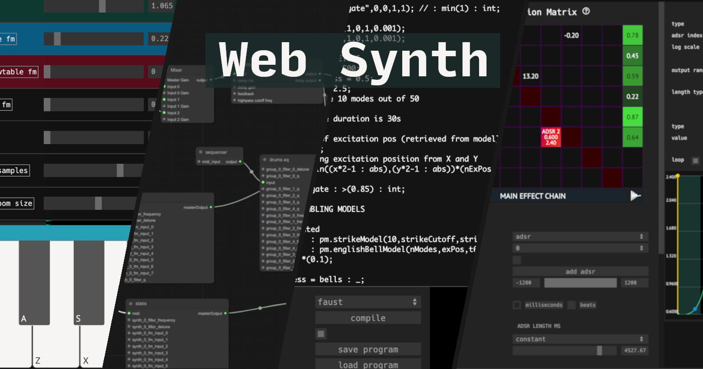

# Web Synth

**Web Synth** is a browser-based audio synthesis, music production, and sound experimentation platform.  It has features of traditional DAWs as well as additional tools to support modular style patching, dynamic custom code, and live looping.

## Try It Yourself

 * Full application: <https://synth.ameo.dev>
 * Standalone FM Synthesizer Demo: <https://synth.ameo.dev/fm.html>
 * Documentation and Development Notes: <https://synth.ameo.dev/docs/>

Or, watch the demo video to get a feel for what it can do:

## Tech

Web synth makes extensive use of many modern web technologies for its operation including Web Audio, WebAssembly, WebGL, WebMIDI, `SharedArrayBuffer`, `AudioWorkletProcessor`, and more.

Web synth supports high performance and low latency realtime audio generation.  It achieves this by compiling code for synthesizers, effects, and other audio nodes from Rust and other specialized languages into WebAssembly and running it on the dedicated audio thread.  This offers near-native performance and jank-free playback.

Because of this, Web Synth requires a modern browser to run.  Although it will technically load on mobile devices and phones, the UI isn't optimized for mobile use at this time.

## Notable Features

*   Versatile 8-operator polyphonic FM Synthesizer
    *   Supports many primitive waveforms as well as loading wavetables from [WaveEdit](https://synthtech.com/waveedit/) or other sources
    *   Contains a number of built-in effects from basics like bitcrusher and filters to OTT-style multiband compression and wavefolding
    *   Highly modulatable and patchable with sample-level parameter automation via other modules or built-in per-voice envelope generators
*   Fully functional MIDI editor
    *   MIDI file import and export
    *   Multi-note selection and editing
    *   Record live from keyboard or other input source
    *   Live playback and preview
*   Two programmable loopers for samples and MIDI
*   Dynamic compilation of DSP code written in [Faust](https://faust.grame.fr/) and [Soul](https://soul.dev) via WebAssembly
    *   Facilitates infinite custom effects using existing code with minimal or no changes required
    *   Parameters are fully integrated into the web synth patching system allowing them to be modulated by other components or controlled live by auto-generated UI
*   Preset and composition sharing/loading system for many of web synth's components
*   Modular synth-style utilities like LFOs, random voltage sources, and quantizers
*   Variety of visualizers including oscilloscope and spectrum analyzer
*   Support for building custom UIs with many input types and markdown notes
*   Supports hardware MIDI keyboards and controllers via WebMIDI
*   Many other miscellaneous tools and modules like visual filter designer, granular synthesizer, delays, signal debuggers, and more

## Design + Structure

The tool is built on top of the WebAudio API and makes use of it for all audio processing. The WebAudio graph is the backbone of everything and the every piece of audio-processing code exists as a node within it. These nodes are created as different modules within the application and can be connected together using a built-in graph editor. The tool's engine has support for handling de/initialization of nodes, resolving connections, handling input/output shapes changing, and de/serializing on page un/load.

Speaking of that, the whole application state is serialized to the browser's local storage every time the tab is closed and automatically re-loaded when the tab is opened back up again. Saving and loading is as simple as just creating or loading a JSON blob representing the state of `localStorage`. The goal (which is mostly but not completely realized) is that refreshing the page should bring you back to the exact state you were in before automatically with no user intervention required.

## Building + Running for Development

_Note that these docs might be somewhat out of date.  Check the Github Actions CI script and the `Justfile` in the project root for details._

You'll need a few pieces of software in order to build and run this locally. They're mainly for compiling, transforming, and optimizing the WebAssembly blobs that are created as output for the Rust application.

You must have several tools installed in order to build this tool for development:

- The Rust programming language (nightly version): https://rustup.rs/
- The `wasm32-unknown-unknown` target: `rustup target add wasm32-unknown-unknown`
- `wasm-bindgen-cli`: `cargo install wasm-bindgen-cli`
- `wasm-opt`: Clone [https://github.com/WebAssembly/binaryen](binaryen) and follow install instructions there
- NodeJS and [Yarn](https://yarnpkg.com/en/)
- The Just command runner: `cargo install just`
- If you want Faust code support, you'll need to install `go`
- If you want to run the Web API backend which handles presets, composition sharing, and a few other things like that, you'll need to stand up a MySQL database and install the Diesel ORM command line (`cargo install diesel-cli --features=mysql`).

Once you have these tools installed, you can build the project by running `just build-all` (to create an optimized, production deployment) or `just run` (to start a local webserver on port 9000 for development that automatically hot-reloads when the JS/TS code is changed).
